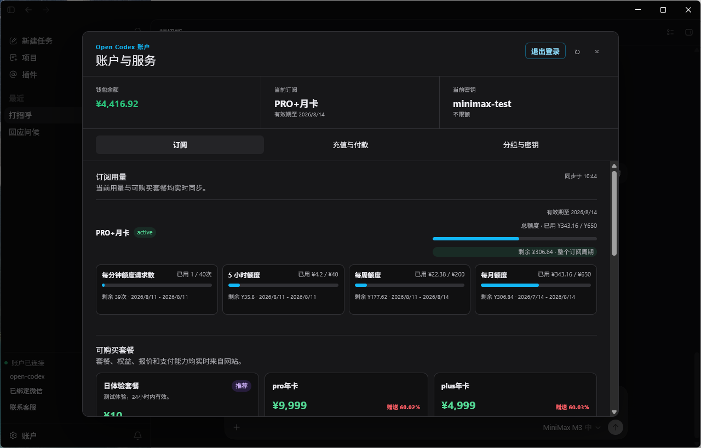
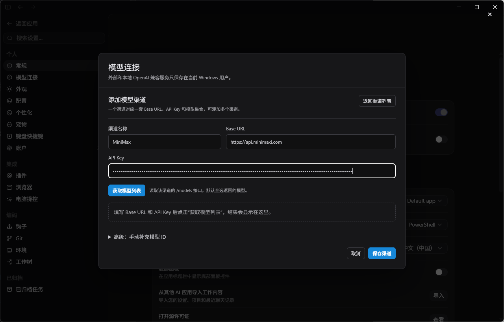
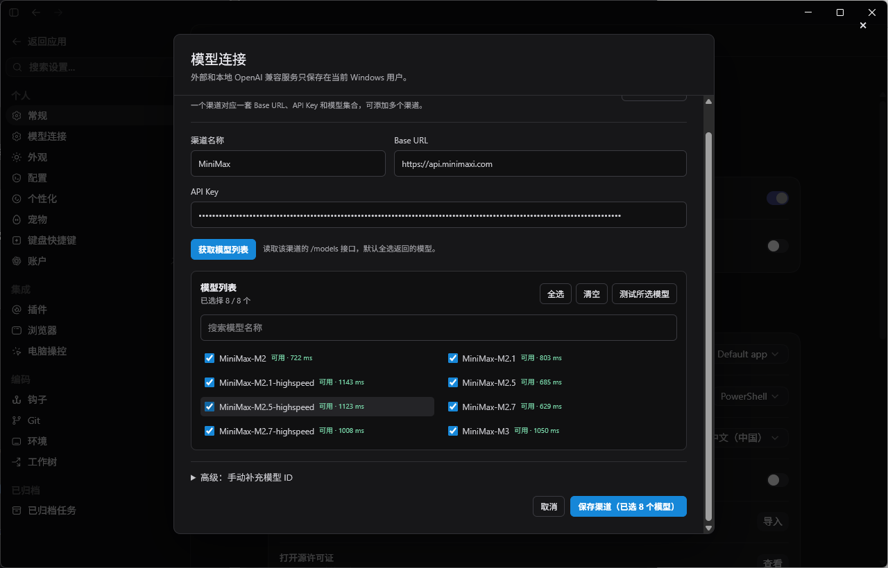
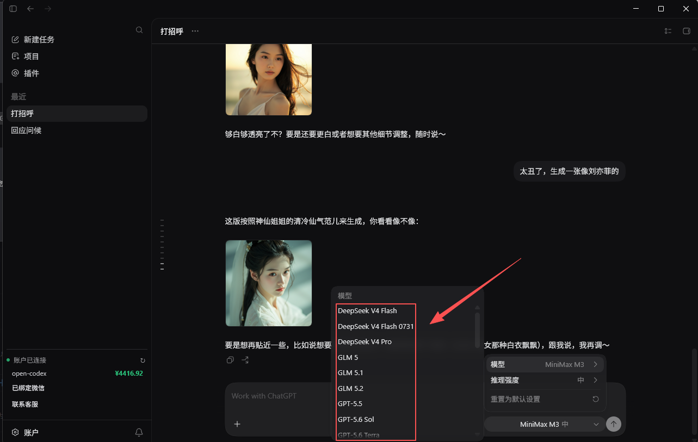
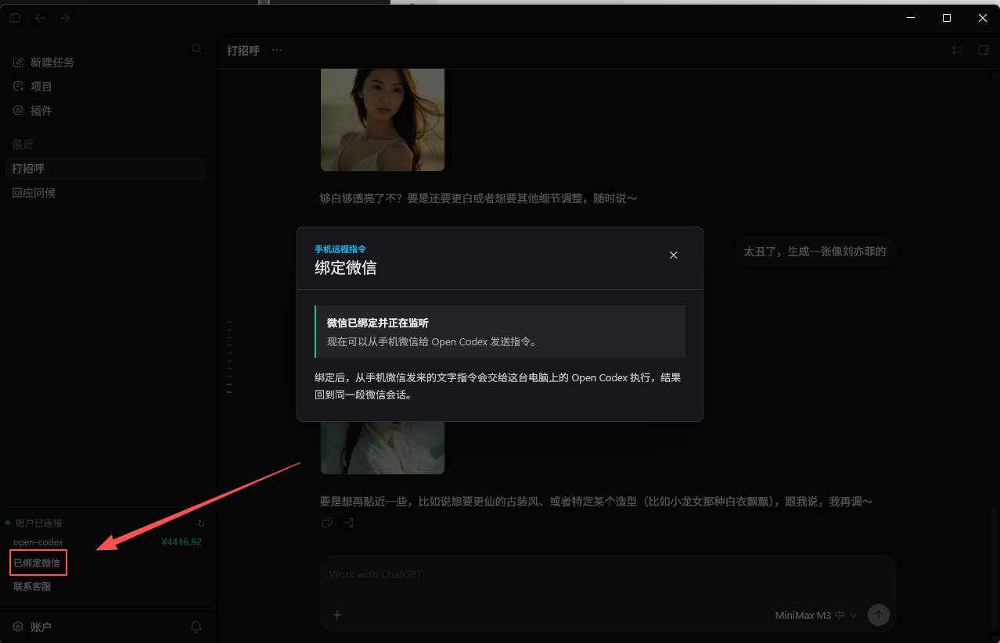
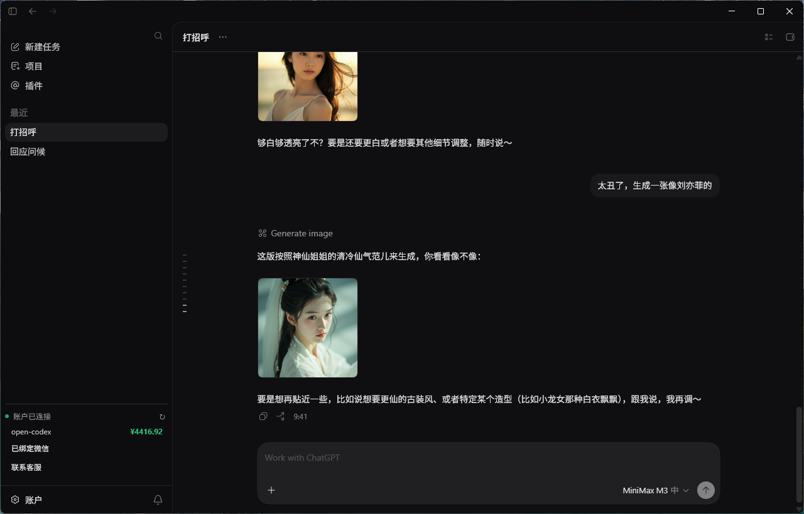

# Open Codex

> 面向中文开发者的 Windows AI 编码工作台：开箱即用，不折腾 Codex 环境，不折腾 CC Switch，把模型接入、项目执行、微信远程控制和图片工作流都放进一个桌面应用里。

Open Codex 适合希望“直接开干”的用户：安装客户端后就能开始接入模型、切换模型、执行任务、处理项目和远程协作，而不是先花大量时间配置运行环境、兼容层和中间代理。

## 核心优势

- **不用下载安装 Codex，也不用安装 Codex 运行环境**：直接安装 Open Codex 即可开始使用。
- **不用下载安装 CC Switch，也不用处理复杂配置**：不需要额外准备模型切换中间层，减少配置和排障成本。
- **外接接口开放**：可以接入你自己的渠道、已有第三方服务，统一纳入客户端使用。
- **直接接入国产模型**：支持接入 MiniMax、DeepSeek 等国内常用模型服务。
- **OpenAI 协议本地模型可直接接入**：已有本地模型或私有服务只要兼容 OpenAI 协议，通常不需要重新做一轮兼容性调整。
- **支持微信远程控制**：可以把微信接入 Open Codex，在手机端远程发指令、查看结果。
- **没有 API 渠道也能快速开始**：在“账户设置”里可通过邮箱快速注册并接入 Open Codex 官方模型。
- **国内网络环境可直接使用**：不用自己再准备科学上网环境，也能连接 OpenAI 模型和国内主流模型；实际可用性以当前账户授权、服务状态和网络情况为准。

## 下载

- [Windows 安装包（V148）](https://github.com/449323370/open-codex/releases/download/v164.0.0/Open-Codex-V164-Windows-Setup-20260814.exe)
- [版本发布页](https://github.com/449323370/open-codex/releases/tag/v149.0.0)

## 上手流程

### 1. 登录账户，直接开始使用

安装完成后，用户可以直接进入账户与服务页面，查看余额、订阅、当前密钥和分组，不需要额外安装 Codex 或准备独立运行环境。

### 2. 添加你自己的模型渠道

如果你已经有自己的 API 渠道，可以直接在“设置 -> 模型连接”里新增外部渠道，填写渠道名称、Base URL 和 API Key。

### 3. 获取模型列表并保存

填写完成后，点击“获取模型列表”，就能直接拉取该渠道的可用模型，筛选后保存到当前客户端。

### 4. 在对话里统一切换模型

无论是官方模型、国产模型，还是你自己接入的第三方模型，都会进入同一个模型选择器里统一切换，不需要再套一层复杂兼容工具。

### 5. 绑定微信，开启远程控制

如果需要远程协作，可以在客户端里绑定微信。绑定后，手机微信可以直接给 Open Codex 发送指令，实现远程控制和结果回传。

### 6. 直接使用图片能力

完成模型接入后，可以直接在会话里调用图片生成能力，不需要额外切换到别的工具链。

## 适合谁

- 想快速用 AI 编码，但不想先配置一堆环境的用户
- 已经有自己 API 渠道、希望统一接入管理的团队
- 需要国产模型、OpenAI 模型和本地模型混合使用的用户
- 需要通过微信远程控制客户端的个人或团队

## 安全边界

不要分享你的 API Key、Cookie、验证码或支付信息。外接渠道的可用模型、价格、额度和能力，以当前服务商返回结果为准。

本仓库用于发布 Open Codex Windows 客户端安装包和使用说明。
